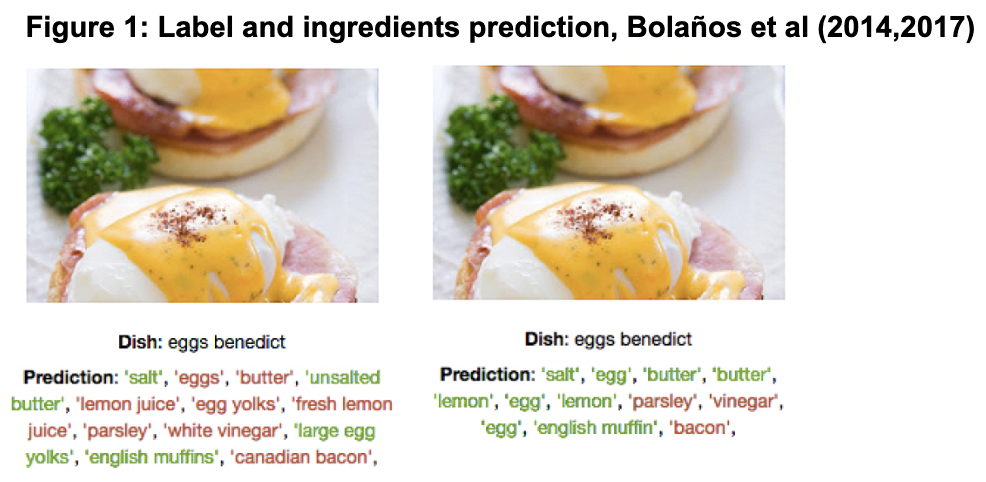
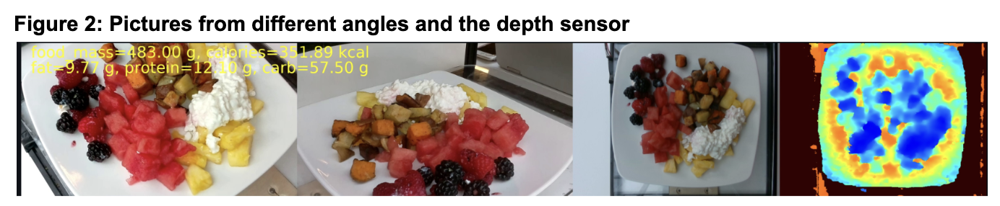

# Dish Detective 🕵️🥯🥬


## Summary

As technology advances, there's a growing trend of people working harder, often resulting in longer hours and less physical activity. This shift is further emphasized by the evolving work culture, where many now navigate a hybrid scene of either working from home or commuting to an office. In this setting, individuals can easily find themselves immersed in work throughout the day, often without paying adequate attention to their diet or what they're consuming. This inadvertently contributes to a more sedentary lifestyle, potentially impacting their overall health and well-being.
Our study is centered on simplifying dietary tracking through the use of image recognition technology. By developing a tool that utilizes food images, we aim to simplify an difficult task for individuals, helping them easily identify the contents of their food and assess its nutritional value. This innovative approach seeks to empower people with a convenient means to make informed decisions about their diet and overall health. 

Three datasets, [Ingredients 101 & Food 101](http://www.ub.edu/cvub/ingredients101/), [Recipes 5k](http://www.ub.edu/cvub/recipes5k/), and [Nutrition5k](https://github.com/google-research-datasets/Nutrition5k), were utilized, with a focus on 11 food types due to computational limitations. A three-model sequence was employed, starting with an InceptionV3 model pretrained on ImageNet for food type prediction, achieving 78% training and 90% validation accuracy. Subsequently, Recipes5k was used to identify ingredients, followed by connecting food types to nutritional values using generative AI like ChatGPT. The model's predictions were compared to Nutrition5k, revealing overestimations in fat, carbs, and protein percentages. To enhance accuracy, the study suggests utilizing comprehensive databases like "FoodData" from the U.S. Department of Agriculture. The final model was integrated into an application for user-friendly food label, ingredient, and nutritional information retrieval from uploaded images.

## Data sources

[Ingredients 101 & Food 101](http://www.ub.edu/cvub/ingredients101/)
[Recipes 5k](http://www.ub.edu/cvub/recipes5k/)

These datasets comes with dish labels and simplified ingredients as well its nutrition percentage by gram.



[Nutrition 5k](https://console.cloud.google.com/storage/browser/nutrition5k_dataset/nutrition5k_dataset/metadata?pageState=(%22StorageObjectListTable%22:(%22f%22:%22%255B%255D%22))&prefix=&forceOnObjectsSortingFiltering=false)



To get the images from ```dishes_test.txt```  make ```download_images.sh``` executable using ```chmod +x download_images.sh .``` Then, you can run the script using ```./download_images.sh .```

## Pre-Processing

Our primary objective is to provide users with the percentage breakdown of key nutritional categories—specifically fat, carbs, and proteins—found in any dish using image recognition technology. Our goal goes beyond just identifying the ingredients; we aim to reveal the nutritional composition, recognizing that a dish's healthiness isn't solely determined by its ingredients list.

We began our journey with the first two datasets from Bolaños et al. (2017): "Food 101" for labels and "Recipes5k" for ingredients. To gather detailed nutritional information, we accessed recipes from OpenAI's API using these dish names and ingredients, ensuring precise measurements in grams rather than vague units like "one spoon" or "half cup." Due to time constraints, we simplified the ingredients to match them with our simplified nutrition values from Bolaños, which cover 555 ingredients and their protein, fat, and carb distribution.

For instance, initially, "baby back ribs" were missing from our nutritional table. However, using similarity embeddings, we successfully matched it with the label "ribs" in the nutritional metadata.

Our analysis was further refined by calculating the nutritional percentage distribution of various dish sizes, a critical aspect that was previously overlooked by our models. This comprehensive approach enhances the reliability of our conclusions, ensuring that users receive accurate and insightful information about the nutritional content of their meals.

## Experiment

The primary objective was to assess the effectiveness of different prediction methods and model architectures in enhancing our understanding of holistic nutritional content. We established a baseline using the widely adopted EfficientNetV2-L architecture. Subsequently, we contrasted its performance with that of InceptionV3, which emerged as the superior performer in our experimental evaluations.

We used InceptionV3 because it was used in multiple recent papers, found in our research [Thames 2021, Bolanos 2017](https://doi.org/10.1109/cvpr46437.2021.00879). It provides a basis for comparison and ensures consistency with previous research. Additionally, selecting EfficientNetV2-L, a more complex model, allows for a comprehensive comparison of different architectures and provides insights into the trade-offs between model complexity and performance. 
To gauge the performance of these models accurately, we employed a combination of accuracy and loss metrics. Beyond mere quantitative assessments, we delved deeper into the implications of our findings by considering the insights gleaned from the previously mentioned Thames study. This study offered a valuable perspective by integrating human predictions into their evaluation framework, enriching our understanding of the models' practical applicability.


## Results

We ended up building an app from the three models we fine tuned predicting the dish label, the ingredients and the nutrition distribution:


#### Members

>> - [Rafael Davila Bugarin](https://github.com/bugarin10)
>> - [Katelyn Hucker](https://github.com/katelyn-hucker)
>> - [Udyan Sachdev](https://github.com/udyansachdev1)
>> - [Keon Nartey](https://github.com/Keonnartey)
